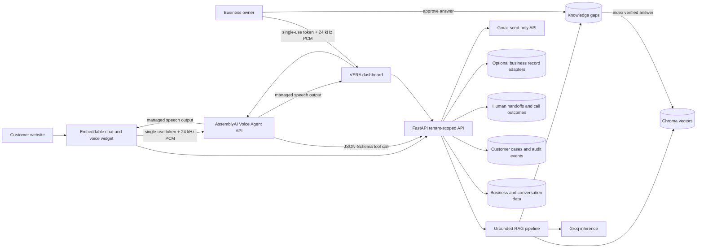

# VERA

VERA is a grounded, voice-enabled action platform for any business. A business can upload its
knowledge, customize an assistant, embed it on any website, review conversations, capture
appointments, reservations, leads, service requests or support cases, and optionally send
confirmed follow-up emails through its own Gmail account.

Business calls can run through AssemblyAI's end-to-end Voice Agent API: Universal-3 Pro speech
recognition, semantic turn-taking and interruption handling, LLM routing, JSON-Schema tool calls,
and natural voice output share one managed connection. If that optional runtime is disabled or
unavailable, VERA automatically preserves its existing streaming-STT/browser-speech voice mode.

The voice workflow also records operational outcomes. After answering a knowledge question it asks
whether the request was resolved; a negative response or an explicit request for a person creates a
category-routed human handoff with conversation context. The Action Center lets the business accept
and complete handoffs and inspect call summaries, intent, sentiment, turns, and interruptions.

The closed-loop Knowledge Gaps workflow makes the assistant improve without silently learning from
untrusted customer messages: unanswered questions are ranked for the owner, and only an
owner-approved answer is indexed.

## Demo story

1. Create the NovaNest demo business and upload [`demo/novanest-support.md`](demo/novanest-support.md).
2. Start the microphone in **Customize Assistant** and show the **AssemblyAI Voice Agent** badge.
3. Ask a known question aloud and show the grounded source. Interrupt the reply once to demonstrate
   semantic barge-in.
4. Ask a question that is absent from the uploaded document. VERA answers using its existing safe
   support behavior and records a Knowledge Gap.
5. Open **Knowledge Base**, enter the verified answer, and select **Approve & teach VERA**.
6. Ask the question again to show that the approved answer is now retrieved.
7. Open **Action Center**. Its voice-action examples adapt to the category in Business Settings:
   appointments, reservations, leads, technical requests, commerce, or a general workflow.
8. Ask a normal question and answer "No, that did not help; I need a human about billing." Open the
   routed handoff in **Action Center**, accept it, and show that its conversation context is retained.
9. End the call and show its outcome, summary, intent, sentiment, turns, and interruption count.
10. Ask for an appointment, quote, reservation, callback, or another actionable follow-up. Say
   "create the case" (or use the button) after reviewing it.
11. Assign the case, change its lifecycle status, and show its audit log and AssemblyAI session ID.
    Email remains a separate optional action and is never opened or sent automatically.
12. For the optional commerce demo, use a Retail/E-commerce category, load demo orders, and ask
    "Where is order NN-1042?" No Gmail or Twilio is needed for the browser-call flow.
13. Open **Overview** to show conversations, grounded coverage, open gaps, action emails, and
    active customer cases.

## Architecture



## Local setup

### Backend

```powershell
cd backend
python -m venv .venv
.\.venv\Scripts\Activate.ps1
pip install -r requirements.txt
Copy-Item .env.example .env
uvicorn app.main:app --reload
```

Configure the keys and OAuth callback URLs in `backend/.env`. Generate `TOKEN_ENCRYPTION_KEY` with:

```powershell
python -c "from cryptography.fernet import Fernet; print(Fernet.generate_key().decode())"
```

To enable the sponsor-native voice runtime, set:

```dotenv
ASSEMBLYAI_API_KEY=your_key
ASSEMBLYAI_VOICE_AGENT_ENABLED=true
ASSEMBLYAI_VOICE_AGENT_VOICE=alba
```

The browser receives only a short-lived, single-use token. If Voice Agent API access has not yet
been enabled for the AssemblyAI account, VERA falls back automatically to standard voice mode.

### Frontend

```powershell
cd frontend
npm install
npm run dev
```

Open `http://localhost:5173`. The API runs at `http://localhost:8000` by default.

## Trust and isolation

- Retrieval is scoped by business ID; one tenant cannot query another tenant's documents.
- Public widgets use unguessable assistant IDs and optional origin allowlists.
- Unknown business facts are not added automatically. An owner must approve every learned answer.
- Gmail requests only send permission; refresh tokens are encrypted and never sent to the frontend.
- Action emails require explicit review and confirmation.
- Normal information questions cannot accidentally trigger action intake, and contact email is
  optional even when a case is created.
- Human handoffs are tenant-scoped and retain the conversation ID and voice session context.
- Case and connector endpoints enforce business ownership; public case actions also require the
  widget visitor's conversation session ID.
- Each customer case records its source channel and AssemblyAI session ID when available.

## Verification

```powershell
cd backend
.\.venv\Scripts\python.exe -m unittest tests.test_knowledge_gaps -v
.\.venv\Scripts\python.exe -m unittest tests.test_voice_agent -v
.\.venv\Scripts\python.exe -m unittest tests.test_support_desk -v

cd ..\frontend
npm run lint
npm run build
```
