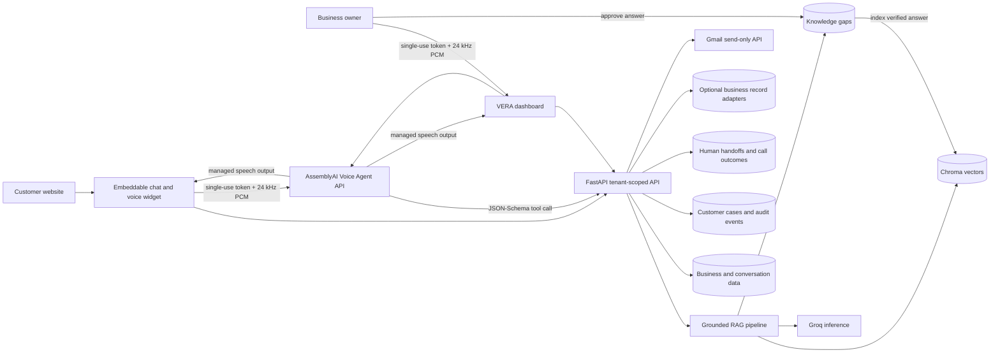

# VERA

VERA is a grounded, voice-enabled action platform for any business. A business can upload its
knowledge, customize an assistant, embed it on any website, review conversations, capture
appointments, reservations, leads, service requests or support cases, and optionally send
confirmed follow-up emails through its own Gmail account.

Business calls can run through AssemblyAI's end-to-end Voice Agent API: Universal-3 Pro speech
recognition, semantic turn-taking and interruption handling, LLM routing, JSON-Schema tool calls,
and natural voice output share one managed connection. If that optional runtime is disabled or
unavailable, VERA automatically preserves its existing streaming-STT/browser-speech voice mode.

The voice workflow also records operational outcomes. After answering a knowledge question it asks
whether the request was resolved; a negative response or an explicit request for a person creates a
category-routed human handoff with conversation context. The Action Center lets the business accept
and complete handoffs and inspect call summaries, intent, sentiment, turns, and interruptions.

The closed-loop Knowledge Gaps workflow makes the assistant improve without silently learning from
untrusted customer messages: unanswered questions are ranked for the owner, and only an
owner-approved answer is indexed.

## Demo story

1. Create the NovaNest demo business and upload [`demo/novanest-support.md`](demo/novanest-support.md).
2. Start the microphone in **Customize Assistant** and show the **AssemblyAI Voice Agent** badge.
3. Ask a known question aloud and show the grounded source. Interrupt the reply once to demonstrate
   semantic barge-in.
4. Ask a question that is absent from the uploaded document. VERA answers using its existing safe
   support behavior and records a Knowledge Gap.
5. Open **Knowledge Base**, enter the verified answer, and select **Approve & teach VERA**.
6. Ask the question again to show that the approved answer is now retrieved.
7. Open **Action Center**. Its voice-action examples adapt to the category in Business Settings:
   appointments, reservations, leads, technical requests, commerce, or a general workflow.
8. Ask a normal question and answer "No, that did not help; I need a human about billing." Open the
   routed handoff in **Action Center**, accept it, and show that its conversation context is retained.
9. End the call and show its outcome, summary, intent, sentiment, turns, and interruption count.
10. Ask for an appointment, quote, reservation, callback, or another actionable follow-up. Say
   "create the case" (or use the button) after reviewing it.
11. Assign the case, change its lifecycle status, and show its audit log and AssemblyAI session ID.
    Email remains a separate optional action and is never opened or sent automatically.
12. For the optional commerce demo, use a Retail/E-commerce category, load demo orders, and ask
    "Where is order NN-1042?" No Gmail or Twilio is needed for the browser-call flow.
13. Open **Overview** to show conversations, grounded coverage, open gaps, action emails, and
    active customer cases.

## Architecture


```mermaid
flowchart LR
    Customer[Customer website] --> Widget[Embeddable chat and voice widget]
    Owner[Business owner] --> Dashboard[VERA dashboard]
    Dashboard --> API[FastAPI tenant-scoped API]
    Widget --> API
    Widget -->|single-use token + 24 kHz PCM| AAI[AssemblyAI Voice Agent API]
    Dashboard -->|single-use token + 24 kHz PCM| AAI
    AAI -->|JSON-Schema tool call| API
    AAI -->|managed speech output| Widget
    AAI -->|managed speech output| Dashboard
    API --> RAG[Grounded RAG pipeline]
    RAG --> Chroma[(Chroma vectors)]
    RAG --> Groq[Groq inference]
    RAG --> Gaps[(Knowledge gaps)]
    Owner -->|approve answer| Gaps
    Gaps -->|index verified answer| Chroma
    API --> SQLite[(Business and conversation data)]
    API --> Actions[(Customer cases and audit events)]
    API --> Handoffs[(Human handoffs and call outcomes)]
    API --> Connectors[(Optional business record adapters)]
    API --> Gmail[Gmail send-only API]
```

## Local setup

The free chat at `/dashboard` supports a continuous voice conversation. Start the microphone
once, ask follow-up questions, and interrupt or say "stop" to silence a reply while the mic
stays on. **Stop response** also cancels an answer while it is being generated. The square
**End voice conversation** button releases the microphone while keeping the current chat
available for typing or restarting voice. Both the free dashboard and the business assistant
prefer AssemblyAI's managed Voice Agent API. Set `ASSEMBLYAI_VOICE_AGENT_ENABLED=true` and
configure `ASSEMBLYAI_API_KEY` in `backend/.env`; no additional dependency or stored agent
publication is needed.

In managed mode the browser sends 24 kHz PCM audio directly to AssemblyAI, which handles
turn detection and streamed speech output. Ordinary questions are answered there directly;
the `use_vera` JSON-Schema tool routes maps, nearby searches, visuals, and screen changes
through the existing VERA conversation socket. API keys remain on the backend. Tool results
return only after `reply.done`, and cancelled tool events cannot update the screen. Browser
speech synthesis is not used for managed replies.
Free managed turns use 300 ms minimum and 1000 ms maximum silence. These explicit values
disable provider adaptive endpointing; increase `FREE_VOICE_AGENT_MIN_SILENCE_MS` and
`FREE_VOICE_AGENT_MAX_SILENCE_MS` if pauses split a sentence before you finish speaking.
Free capture applies a light noise gate to quiet hum and isolated clicks while continuing to
stream silence. It keeps a short speech tail and buffered onset to avoid clipping words, and
disables automatic microphone gain to avoid amplifying room noise. Managed detection uses
`FREE_VOICE_AGENT_VAD_THRESHOLD=0.65`, a 150 ms interruption confirmation, and
`FREE_VOICE_AGENT_VOICE_FOCUS=far-field` for laptop microphones; use `near-field` for a headset.
Very quiet/distant speech may need the microphone closer or a lower VAD threshold.

In the business test panel, grounded answer text appears with the first reply audio chunk.
The status follows actual playback (Speaking), including audio still queued after the provider
finishes generation, and clears when playback ends or is interrupted.

Spoken transcripts are synchronized into VERA's chat history. Typing during voice adds the
message to the managed conversation; typing after ending voice uses the normal VERA pipeline.
Restarting voice supplies recent chat and screen context. The Stop response button silences
playback immediately and cancels VERA tool work while microphone capture continues. The provider
handles spoken interruptions; it may finish generating a locally muted reply. Ending the
conversation sends `session.end`, releases capture/playback, and leaves typed chat available.

If managed setup fails or is disabled, the dashboard shows **standard mode** and uses the
existing AssemblyAI Realtime STT / Groq / browser-speech pipeline. Its 100 ms audio packets,
bounded upload backlog, 8-second startup deadline, and explicit `Terminate` cleanup remain.
`FREE_VOICE_MIN_TURN_SILENCE_MS` and `FREE_VOICE_MAX_TURN_SILENCE_MS` tune only this fallback.
`FREE_VOICE_RESPONSE_TIMEOUT_SECONDS` and `FREE_VOICE_VISUAL_TIMEOUT_SECONDS` bound VERA's
model/tool work in either mode. Backend `[latency]` logs report model/tool time. Managed
browser `[voice timing] first_audio_ms` measures from the provider's speech-stopped event
to the first received audio chunk; it excludes the provider's preceding endpointing delay.

To check real provider connectivity, run `.venv\Scripts\python.exe scripts\check_free_managed_voice.py`
from `backend` with the server running. This opt-in check consumes provider credits, checks
consecutive replies and a visual tool, and closes its session. It uses text prompts plus
silent audio, so physical microphone quality and spoken interruption latency still require
a browser check: ask a question, interrupt with "stop", ask a follow-up, request a diagram,
then end voice and continue typing.
For a speech-input check, pass `--speech-dir <directory>` containing three synthetic mono
PCM16 24 kHz files named `1.wav`, `2.wav`, and `3.wav`: a greeting request, a follow-up,
and a request to display a diagram. These files are streamed at real-time speed.

### Backend

```powershell
cd backend
python -m venv .venv
.\.venv\Scripts\Activate.ps1
pip install -r requirements.txt
Copy-Item .env.example .env
uvicorn app.main:app --reload
```

Configure the keys and OAuth callback URLs in `backend/.env`. Generate `TOKEN_ENCRYPTION_KEY` with:

```powershell
python -c "from cryptography.fernet import Fernet; print(Fernet.generate_key().decode())"
```

To enable the sponsor-native voice runtime, set:

```dotenv
ASSEMBLYAI_API_KEY=your_key
ASSEMBLYAI_VOICE_AGENT_ENABLED=true
ASSEMBLYAI_VOICE_AGENT_VOICE=alba
```

The browser receives only a short-lived, single-use token. If Voice Agent API access has not yet
been enabled for the AssemblyAI account, VERA falls back automatically to standard voice mode.

### Frontend

```powershell
cd frontend
npm install
npm run dev
```

Open `http://localhost:5173`. The API runs at `http://localhost:8000` by default.

## Trust and isolation

- Retrieval is scoped by business ID; one tenant cannot query another tenant's documents.
- Public widgets use unguessable assistant IDs and optional origin allowlists.
- Unknown business facts are not added automatically. An owner must approve every learned answer.
- Gmail requests only send permission; refresh tokens are encrypted and never sent to the frontend.
- Action emails require explicit review and confirmation.
- Normal information questions cannot accidentally trigger action intake, and contact email is
  optional even when a case is created.
- Human handoffs are tenant-scoped and retain the conversation ID and voice session context.
- Case and connector endpoints enforce business ownership; public case actions also require the
  widget visitor's conversation session ID.
- Each customer case records its source channel and AssemblyAI session ID when available.

## Verification

```powershell
cd backend
.\.venv\Scripts\python.exe -m unittest tests.test_knowledge_gaps -v
.\.venv\Scripts\python.exe -m unittest tests.test_voice_agent -v
.\.venv\Scripts\python.exe -m unittest tests.test_support_desk -v

cd ..\frontend
npm run lint
npm run build
```

## Deploy on Render (free demo)

The repository includes a root `Dockerfile` and `render.yaml` that build the
React application and serve it from the same FastAPI service.

1. Push this repository to GitHub.
2. In Render, choose **New > Blueprint** and select the repository.
3. Enter the requested API keys. Render automatically generates the session
   and token-encryption secrets.
4. After Render shows the service URL, add these exact URLs to the Google OAuth
   application's authorized redirect URIs:
   - `https://YOUR-SERVICE.onrender.com/api/auth/google/callback`
   - `https://YOUR-SERVICE.onrender.com/api/gmail/callback`

The app automatically reads Render's public service URL, so no frontend URL,
backend URL, or callback URL environment variables are needed on Render.

Render's free filesystem is ephemeral. SQLite records and Chroma knowledge
uploads can be lost after a restart, redeploy, or idle spin-down, so this setup
is intended for demos. Moving those stores to managed services is required for
durable production data.

The app shows a collapsible **Demo mode** notice explaining wake-up delays and
temporary data storage. **Got it** remembers the acknowledgement for the browser
tab's session; the notice can be reopened from any page. Once hosting supports
durable data, set `VITE_SHOW_DEMO_NOTICE=false` when building the frontend to hide it.
